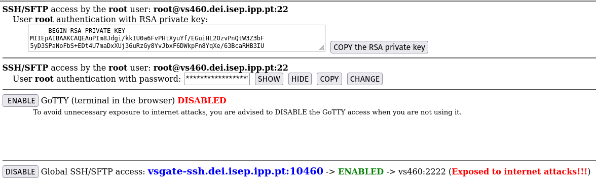

## This wiki page details the deployment of the server in the DEI infrastructure.

### Deployment of the server in the DEI infrastructure

### Part 0
#### Setting up the requirmenets
- 1 - We will be setting up the server in the DEI infrastructure.
    - 1.1 - First we will configure the DEI VPN.
        - 1.1.1 - [Follow the official instructions](https://rede.dei.isep.ipp.pt/usermanual/vpn.html)
        - 1.1.2 - Install the VPN client.
        - 1.1.3 - Configure the VPN client with the DEI credentials.
        - 1.1.4 - Connect to the DEI VPN.
    - 1.2 - Visit the [DEI website](https://vs-ctl.dei.isep.ipp.pt/) and login with your credentials.
    - 1.2 - We will be selecting the appropriate machines for our deployment from the list of available machines.
        - 1.2.1 - We will be using template 29 "MariaDB (similar to MySQL) Server on a Docker Container." for our database
        - 1.2.2 - We will be using template 31 "Debian 12 (bookworm) in a Linux container" for our server and frontend.
        - 1.2.3 - Optionally we can also setup template 25 "Adminer - Databases administration web application (PHP)" for database management.
        - 1.2.4 - Ideally we would use another machine for the Jenkins server. Due to limited credits Jenkins will run on the same machine as the server.

### Part 1
#### Setting up the database
- 1 - We will be starting by setting up the database container.
    - 1.1 - We will be using the MariaDB container template.
    - 1.2 - All the configuration will be done in the template. (for information on how to set up a mariadb container check the docker wiki on this project)
    - 1.3 - The template will provide the following information:
        - 1.3.1 - The IP address of the database container. "MariaDB (MySQL) server:vs1185.dei.isep.ipp.pt"
        - 1.3.2 - The port of the database container. "3306"
        - 1.3.3 - The username of the database. "root"
        - 1.3.4 - The password of the database. 
        - 1.3.5 - The option for internal access to the database(within DEI network), and respective connection string.
        - 1.3.6 - The option for the database to be accessible from the internet, and respective connection string.
    - 1.4 - We will be using the internet accessible connection string to avoid the need for VPN connection to access the database.
    - 1.5 - It's important to note that no database / user is created in this step. The provided credentials are for the root user of the container.
      
    - 1.6 - We can configure a database and user using the Adminer template.
  
### Part 2
#### Setting up the server
- 1 - We will be starting by setting up the server container.
    - 1.1 - We will be using the Debian 12 container template.
    - 1.2 - All the configuration will be done in the template. (for information on how to set up a tomcat container to deploy war files check the docker wiki on this project)
    - 1.3 - The template will provide the following information:
        - 1.3.1 - The SSH/SFTP access by the root user. " root@vs460.dei.isep.ipp.pt:22"
        - 1.3.2 - The port of the server container. "22"
        - 1.3.3 - The username of the server. "root"
        - 1.3.4 - The password of the root user. 
        - 1.3.5 - The RSA private key of the server.
        - 1.3.6 - The option for the server ssh to be accessible from the internet, and respective connection string.
      
    - 1.6 - We can configure the server to run the application using the Jenkins pipeline.
    - 1.7 - We will now ssh into the server and configure the server to run our application.

### Part 3
#### Configuring the server
- 1 - We will ssh into the server after connecting to the VPN.
    - 1.1 - We will ssh into the server using the provided connection string.
    - 1.2 - We will be using the root user to configure the server.
  
       
  
- 2 - Now lets update de server and install the required software. 
  ```bash
    apt update
    apt upgrade
    apt install openjdk-17-jdk
    apt install maven
    apt install git
    apt install tomcat10
    apt install nginx
    apt install nano
    ```
- 3 - Now we will need to add the public ssh key of the server to our github account.
  - 3.1 - Ideally we would use a deploy key but since we dont have access to that option in the repository we will add as a personal key. 
  - 3.2 - We could generate a new ssh key in the server with the following command 
    ```bash
    ssh-keygen -t rsa -b 4096 -C "your@email.address"
    cat ~/.ssh/id_rsa.pub
    ```
  - 3.3 - Since we will be using the provided key we will just cat the key and copy it.
  - 3.4 - We will add the key to our github account.
  - 3.5 - We will clone the repository in the server to make sure everything is working.
      ```bash
      git clone git@github.com:Departamento-de-Engenharia-Informatica/2023-2024-switch-dev-project-assignment-grupo-1.git smarthome
      ```
  - 3.6 - We are getting an error as the port 22 is blocked by the DEI firewall. We will need to use the port 443 to clone the repository.
  - 3.7 - To do so we will need to edit the ssh config file.
    ```bash
    nano ~/.ssh/config
    Host github.com
        HostName github.com
        User git
        Port 443
    ``` 
    - 3.8 - Now we can clone the repository.
        ```bash
        git clone git@github.com:Departamento-de-Engenharia-Informatica/2023-2024-switch-dev-project-assignment-grupo-1.git smarthome
        ```
    - 3.9 - We will try and build the project to make sure everything is working.
    - 3.10 - We will use the bash script that is in the repository to build the project.
        ```bash
        cd smarthome
        ./build.sh
        ```
    
    - 3.11 - Since the memory is limited in the server we will need to limit the memory used by the maven build.
      ```bash
        export MAVEN_OPTS="-Xmx2g"
        ```
### Part 3
#### Installing Jenkins
- 1 - Since this debian template is already running on a docker we wil avoid docker on docker and install jenkins directly on the server.
     - 1.1 - We will install jenkins using the following commands since its not available in debian repository.
        ```bash
        curl -o jenkins.war https://get.jenkins.io/war-stable/2.452.2/jenkins.war
        ```
        - 1.2 - We will start jenkins with the following command.
            ```bash
            nohup java -jar jenkins.war --httpPort=7070
            ```
        - 1.3 - We specify the port in order to avoid conflict with tomcat that also runs on 8080
        - 1.4 - We can now check if all our services are now running.
            ```bash
            netstat -an | grep -E '(:80|:8080|:9090)'
            ```
        
  
     - 1.5 - Since we are running the war directly we need to make sure the application is started on startup
     - 1.6 - Lets make a small bash script and add it to crom job schedule
     - 1.7 - We will create a bash script to start jenkins on startup.
        ```bash
        nano startJenkins.sh
        ```
        ```bash
        #!/bin/bash
        nohup java -jar jenkins.war --httpPort=7070
        ```
     - 1.8 - We will make the script executable.
         ```bash 
         chmod +x startJenkins.sh
         ```
     - 1.9 - We will add the script to the crontab.
         ```bash
         crontab -e
         ```
     - 1.10 - We will add the following line to the crontab.
         ```bash
         @reboot /root/startJenkins.sh
         ```
     - 1.11 - Alternatively we could setup a systemd service to start jenkins on startup.
        

### Part 4
#### Configuring nginx as a reverse proxy
- 1 - Let's configure our nginx proxy to redirect the requests to the tomcat server.
    - 1.1 - We will start by editing the nginx configuration file.
        ```bash
        nano /etc/nginx/sites-available/frontend
        ```
    - 1.2 - We will add the following configuration to the file.
  
      
  
    - 1.3 - We will restart the nginx service.
          ```bash
            systemctl restart nginx
            ```
    - 1.4 - We will now check if the configuration is working.
    - 1.5 - We will connect to the DEI VPN and access the server using the provided connection string.
  
     

    - 1.6 - As we can see jenkins is now accessible. We will create a pipeline to build and deploy the application.
- 2 - We should keep note of the tomcat webapps folder and the nginx html folder.
    - 2.1 - The tomcat webapps folder is located at "/var/lib/tomcat10/webapps"
    - 2.2 - The nginx html folder is located at "/var/www/html"
- 3 - We will now create a pipeline in jenkins to build and deploy the application.

### Part 5
#### Creating a Jenkins pipeline
- 1 - We will create a pipeline in jenkins to build and deploy the application.
    - 1.1 - First we will add our private key to the jenkins credentials.
         - 1.1.1 - We will go to the jenkins dashboard and click on "Manage Jenkins"
         - 1.1.2 - We will click on "Manage Credentials"
         - 1.1.3 - We will click on "Jenkins"
         - 1.1.4 - We will click on "Global credentials"
         - 1.1.5 - We will click on "Add Credentials"
         - 1.1.6 - We will add the private key as a "SSH Username with private key"
         - 1.1.7 - We will add the username as "group1"
         - 1.1.8 - We will add the private key as the private key of the server.
      
    

    - 1.2 - We will now allow first fingerprint verification.
         - 1.2.1 - We will go to the jenkins dashboard and click on "Manage Jenkins"
         - 1.2.2 - We will click on "Configure Global Security"
         - 1.2.3 - We will check the "Allow first fingerprint verification" option.
         - 1.2.4 - We will save the configuration.
    - 1.3 - We will now create a pipeline.
    - 1.4 - The pipeline can be verified in the repository in the Jenkinsfile.

### Part 6
#### Deploying the application
- 1 - Just login with the jenkins credentials and start the pipeline.


- 2 - The pipeline will build the application and deploy it to the tomcat server.


- 3 - There is no stage for tests due to memory limits withing the DEI server