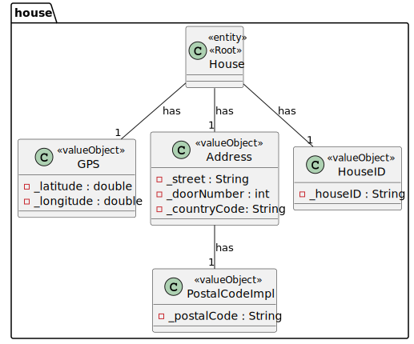
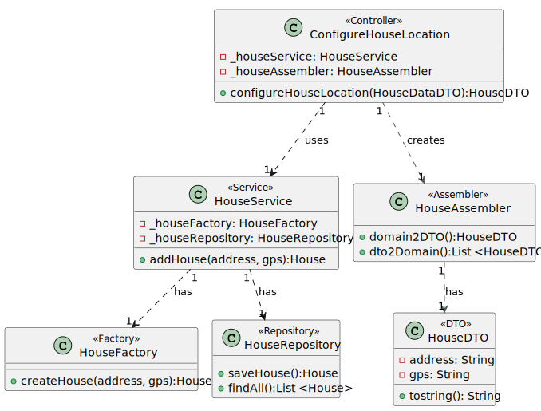
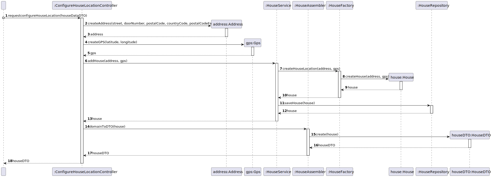

# UC01

## 0. Description

To Configure Location

## 1. Analysis
The location of the house will have an address, GPS a Postal Code.
The location of the house will be added to the house.

### 1.1. Use Case Description
_To configure the location of the house_

    Use Case Name: To configure the location of the house

    Actor: Administrator

    Goal: To configure the location of the house

    Preconditions:
    The Administrator has access to the location management interface within the system.
    The system has a mechanism for storing and accessing the location of the house.

    Basic Flow: 
    Admininstrator selects option to configure the location of the house.
    System adds the location of the house.

### 1.2. Dependency on other use cases
No dependencies.

### 1.3. Relevant domain aggregate model

## 2. Design

### 2.1. Class Diagram

### 2.2. Sequence Diagram

### 2.3. Applied Patterns
- Single Responsibility Principle: Each class has a single responsibility, which promotes a better code organization
- Factory Method: The HouseAssembler class will be used to create the data transfer objects.
- Data Transfer Object: The HouseDTO class will be used to transfer data between the layers of the application.
- Repository: The HouseRepository is used to store and retrieve house data.