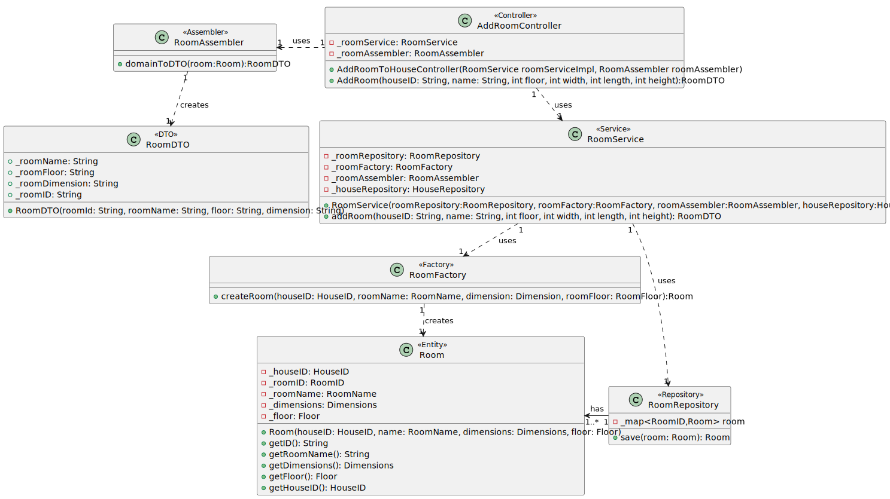

# UC02

## 0. Description

To add Room to House

## 1. Analysis
The room will have a house ID, a name, a floor and dimensions. The room will be added to the house.

### 1.1. Use Case Description
_To add a room to the house_

    Use Case Name: To add a room to the house

    Actor: Administrator

    Goal: To add a new room to the house

    Preconditions:
    The Administrator has access to the rooms management interface within the system.
    The system has a mechanism for storing and accessing the rooms in the house.

    Basic Flow: 
    Admininstrator selects option to add a room to the house.
    System adds the room to the house.

### 1.2. Dependency on other use cases
This use case depends on UC01 (a House must exist).

### 1.3. Relevant domain model aggregates

### 1.4. System Sequence Diagram

## 2. Design

### 2.1. Class Diagram

### 2.2. Sequence Diagram

### 2.3. Applied Patterns
- Single Responsibility Principle: Each class has a single responsibility, which promotes a better code organization
- Factory Method: The RoomAssembler class will be used to create the data transfer objects.
- Data Transfer Object: The RoomDTO class will be used to transfer data between the layers of the application.
- Repository: The RoomRepository is used to store and retrieve room data.
