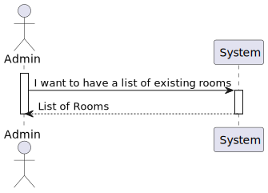
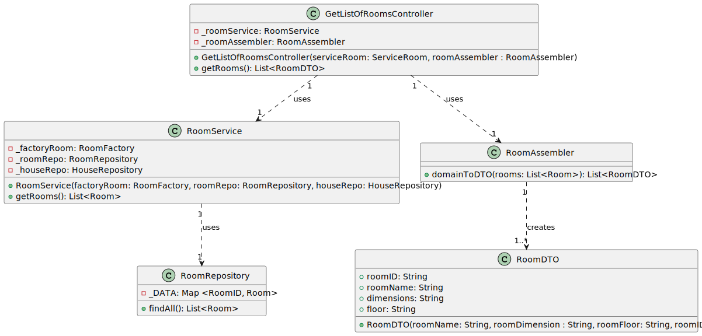

# UC03 

## 0. Description

To get list of Rooms

## 1. Analysis
A collection with all the rooms in the house will be made, initially.
After that, the rooms will be listed.

### 1.1. System Sequence Diagram
_To get list of rooms_

    Use Case name: To get list of rooms

    Actor: Administrator 

    Goal: To get the list of all rooms in the house

    Preconditions:
    The Administrator has access to the room management interface within the system.
    The system has a mechanism for storing and accessing the rooms in the house.
    
    Trigger: The Administrator selects the option to get all rooms in the house.

    Basic Flow:
    The Administrator selects the option to get all rooms in the house.
    The system provides a list with all the rooms in the house.

### 1.2. Dependency on other use cases
No dependencies.

### 1.3. Relevant domain aggregate model

### 1.4. System Sequence Diagram

## 2. Design

### 2.1. Class Diagram
 

### 2.2. Sequence Diagram

### 2.3. Applied Patterns
- Single Responsibility Principle: Each class has a single responsibility, which promotes a better code organization
- Factory Method: The RoomAssembler class will be used to create the data transfer objects.
- Data Transfer Object: The RoomDTO class will be used to transfer data between the layers of the application.
- Repository: The RoomRepository is used to store and retrieve the room data.
