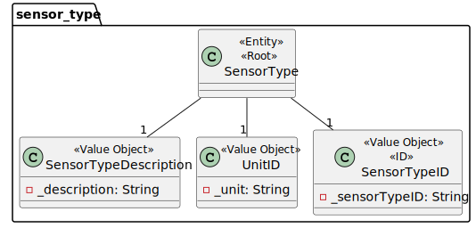
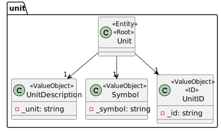
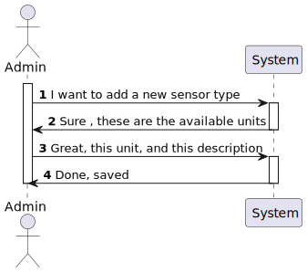
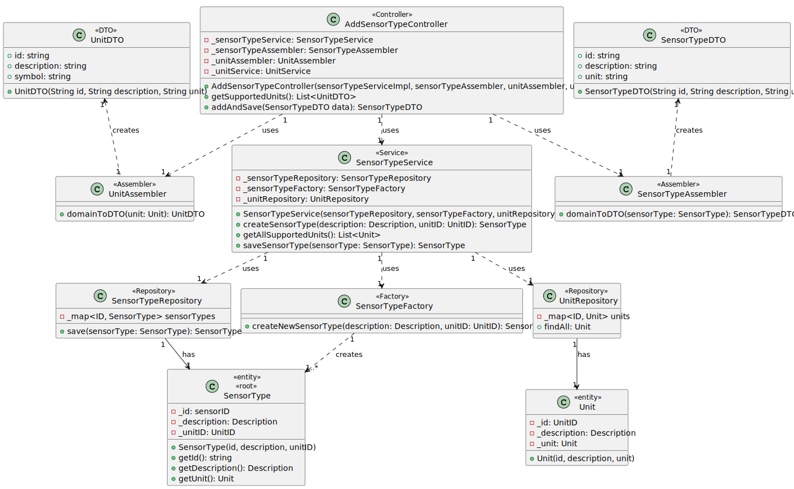
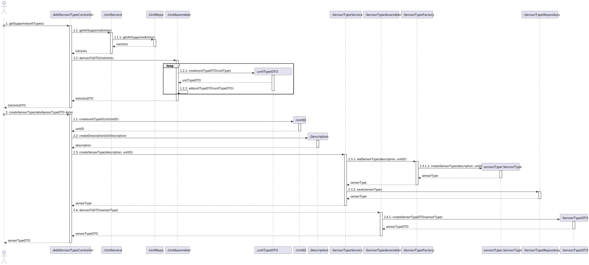
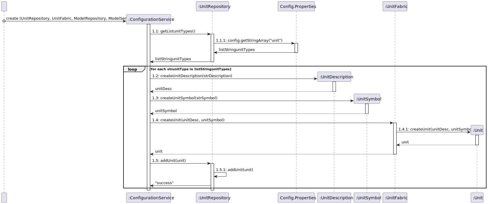

# UC04 

## 0. Description

To define a Sensor Type

## 1. Analysis
The sensor type will have an ID, a description and a unit.
The sensor type will be added to the system.

### 1.1. Use Case description
_To define a sensor type_

    Use Case Name: To define a sensor type
    
    Actor: Administrator
    
    Goal: To add a new sensor type
    
    Preconditions:
    The Administrator has access to the sensor type management interface within the system.
    The system has a mechanism for storing and accessing the sensor types.
    The system has a mechanism for storing and accessing the supported units.

    Trigger: The Administrator selects the option to add a new sensor type.
    
    Basic Flow:
    The Administrator selects the option to add a new sensor type.
    The system provides a list with all the units supported by the system.
    The Administrator selects a unit from the list.
    The system provides a form to fill in the sensor type description.
    The Administrator fills in the sensor type description.
    The Administrator submits the form.
    The system adds the new sensor type to the system.
    
    Alternative Flows:
    Non-existing list: If there are no units supported by the system, the list is empty.
    Invalid description: If the sensor type description is null or empty, the system throws an exception.
    Invalid description: If the sensor type description contains special characters, the system throws an exception.
    Invalid description: If the sensor type description is not unique, the system throws an exception.

### 1.2. Dependency on other use cases
No dependencies.

### 1.3. Relevant domain model aggregates

### 1.4. System Sequence Diagram

## 2. Design
_To tackle the current US we will be using the SensorType Service. Since SensorType only exists with an associated Unit the service should know the 
Unit repository, to provide a list of supported units and check if the given unitID is on the Repo._

### 2.1. Class Diagram

### 2.2. Sequence Diagram
#### 2.2.1 Controller SSD

#### 2.2.2 Load Units SSD

### 2.3. Applied Patterns
- Factory Method: The Sensor Type is created using the factory pattern, that is responsible for creating all supported sensor types
- Single Responsibility Principle: Each class has a single responsibility, this promotes a better code organization and maintainability.
- Data Transfer Object: The sensorTypeDTO is used to transfer the sensorType data between the controller and the service layer.
- Repository: The sensorTypeRepository is used to store and retrieve sensorType data.
