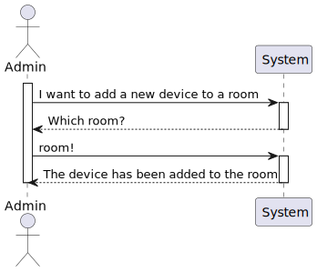
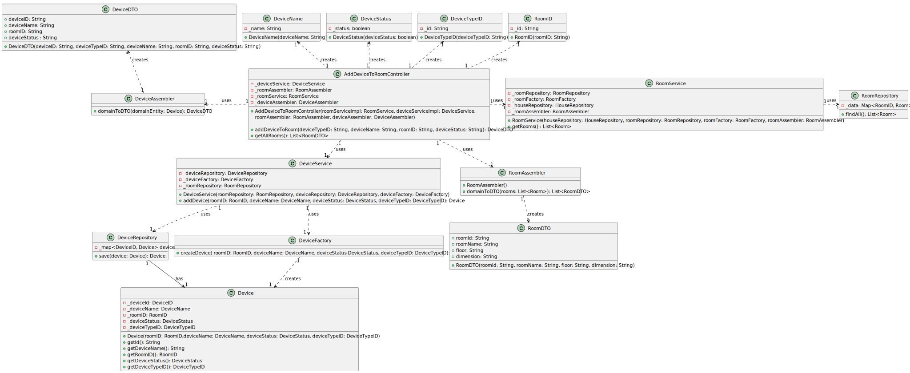
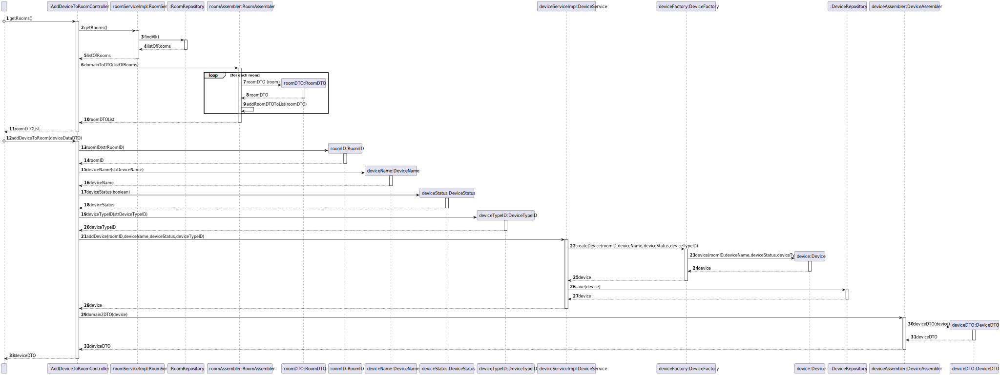

# UC05 

## 0. Description

To add Device to Room

## 1. Analysis
The device will have an ID, a room ID, a name, a type and a status.
The device will be added to a room.

### 1.1. Use Case description
_To add a device to a room_

    Use Case Name: To add a device to a room
    
        Actor: Power User / Administrator
        
        Goal: To add a device to a room
        
        Preconditions:
        The Power User / Administrator has access to the device management interface within the system.
        The system has a mechanism for storing and accessing the devices in the house.
        The system has a mechanism for storing and accessing the rooms in the house.
        
        Trigger: The Power User / Administrator selects the option to add a device to a room.
        
        Basic Flow:
        The Power User / Administrator selects the option to add a device to a room.
        The system provides a list with all the devices in the house.
        The Power User / Administrator selects the device to add to the room.
        The system provides a list with all the rooms in the house.
        The Power User / Administrator selects the room to add the device.
        The system adds the device to the room.
        
        Alternative Flows:
        Non-existing list: If there are no devices in the house, the list is null.
        Non-existing list: If there are no rooms in the house, the list is null.

### 1.2. Dependency on other use cases
Depends on UC03 because the list of rooms is needed to add a device to a room.

### 1.3. Relevant domain aggregate model

### 1.4. System Sequence Diagram

## 2. Design

### 2.1. Class Diagram

### 2.2. Sequence Diagram

### 2.3. Applied Patterns
- Single Responsibility Principle: Each class has a single responsibility, which promotes a better code organization and maintainability.
- Data Transfer Object: The deviceDTO is used to transfer the device data between the controller and the service layer.
- Repository: The deviceRepository is used to store and retrieve device data.
