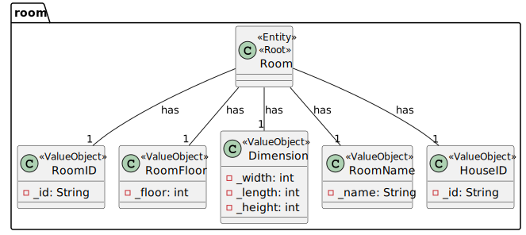

# UC06 

## 0. Description

To get Device(s) from a Room

## 1. Analysis
The system will provide a list of all devices in a room.

### 1.1. Use Case Description
_To get list of devices in a room_

    Use Case name: To get list of devices in a room

    Actor: Room Owner / Power User / Administrator 

    Goal: To get the list of all devices in a room

    Preconditions:
    The Room Owner / Power User / Administrator has access to the device management interface within the system.
    The system has a mechanism for storing and accessing the devices.
    Each device has a room ID that identifies which room it belongs to.
    
    Trigger: The Room Owner / Power User / Administrator selects the option to get all devices in a room.

    Basic Flow:
    The Room Owner / Power User / Administrator selects the option to get all devices in a room.
    The system provides a list of all rooms.
    The Room Owner / Power User / Administrator selects the room.
    The system provides a list with all the devices in the room.

### 1.2. Dependency on other use cases
This use case has dependencies with US03. This use case requires a list of all rooms in the house.

### 1.3. Relevant domain aggregate model

### 1.4. System Sequence Diagram

## 2. Design

### 2.1. Class Diagram

### 2.2. Sequence Diagram

### 2.3. Applied Patterns
- Single Responsibility Principle: Each class has a single responsibility, which promotes a better code organization
- Factory Method: The RoomAssembler and DeviceAssembler classes will be used to create the data transfer objects.
- Data Transfer Object: The RoomDTO and DeviceDTO classes will be used to transfer data between the layers of the application.
- Repository: The RoomRepository is used to store and retrieve room data.

      