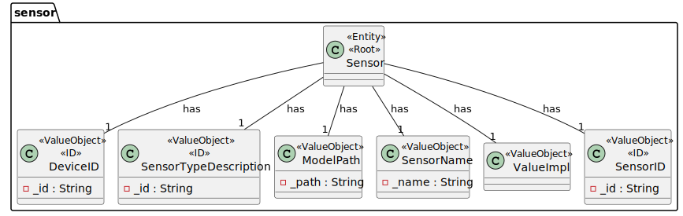
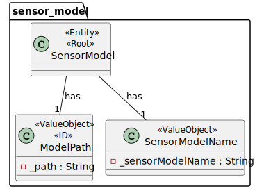
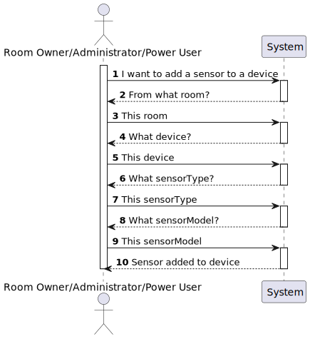
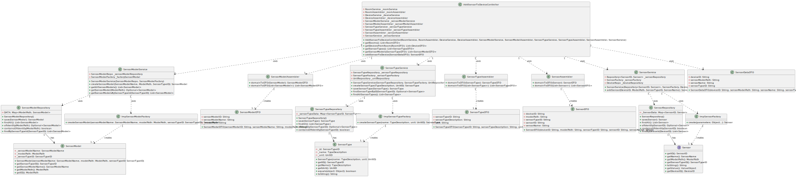

# UC07 

## 0. Description

To add a Sensor to an existing Device in a Room.

## 1. Analysis
All sensors will have an ID, a device ID, a model, a name, a sensor type ID and a value.
Some sensors might have additional information.

### 1.1. Use Case description
_To add a sensor to an existing device in a room_

    Use Case Name: Add a sensor to an existing device in a room
    
    Actor: Power User (or Administrator)
    
    Goal: To add a sensor to an existing device in a room
    
    Preconditions:
    The Power User (or Administrator) has access to the sensor management interface within the system.
    The system has a mechanism for storing and accessing the rooms.
    The system has a mechanism for storing and accessing the devices.
    The system has a mechanism for storing and accessing the sensor models.
    The system has a mechanism for storing and accessing the sensor types.
    
    Trigger: The Power User (or Administrator) selects the option to add a sensor.
    
    Basic Flow:
    The Power User (or Administrator) selects the option to add a sensor to an existing device in a room.
    The system provides a list with all the rooms in the house.
    The Power User (or Administrator) selects a room from the list.
    The system provides a list with all the devices in the room.
    The Power User (or Administrator) selects a device from the list.
    The system provides a list with all the sensor types supported by the system.
    The Power User (or Administrator) selects a sensor type from the list.
    The system provides a list with all the sensor models of that type supported by the system.
    The Power User (or Administrator) selects a sensor model from the list.
    The system provides a form to fill in the sensor description.
    The Power User (or Administrator) fills in the sensor description.
    The Power User (or Administrator) submits the form.
    The system adds the new sensor to the device.
    
    Alternative Flows:
    Non-existing list: If there are no rooms in the house, the list is empty.
    Non-existing list: If there are no devices in the room, the list is empty.
    Non-existing list: If there are no sensor models supported by the system, the list is empty.
    Non-existing list: If there are no sensor types supported by the system, the list is empty.    
    Invalid description: If the sensor description is null or empty, the system throws an exception.
    Invalid description: If the sensor description contains special characters, the system throws an exception.
    Invalid description: If the sensor description is not unique, the system throws an exception.

### 1.2. Dependency on other use cases
This use case depends on UC06.

### 1.3. Relevant domain model aggregates

### 1.4. System Sequence Diagram

## 2. Design

### 2.1. Class Diagram

### 2.2. Sequence Diagram

### 2.3. Applied Patterns
- Factory Method: The sensor is created using the factory pattern, that is responsible for creating all supported sensor models
- Single Responsibility Principle: Each class has a single responsibility, this promotes a better code organization and maintainability.
- Data Transfer Object: The sensorDTO is used to transfer the sensor data between the controller and the service layer.
- Repository: The sensorRepository is used to store and retrieve sensor data.

