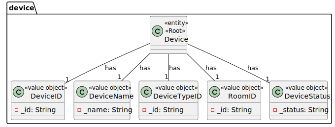
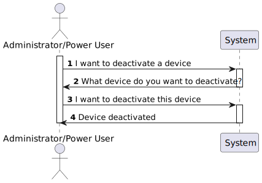

# UC08 

## 0. Description

To deactivate a Device

## 1. Analysis
The system will deactivate an existing active device.

### 1.1. Use Case description
_To deactivate a device_
    
        Use Case Name: To deactivate a device
    
        Actor: Power User/ Admnistrator
    
        Goal: To deactivate a device
    
        Preconditions:
        The Power User has access to the device management interface within the system.
        The system has a mechanism for storing and accessing the devices in the house.
    
        Trigger: The Power User/Administrator selects the option to deactivate a device.
    
        Basic Flow:
        The Power User / Admnistrator selects the option to get all devices.
        The system provides a list with all the devices in the house.
        The Power User / Admnistrator selects the device to deactivate.
        The system deactivates the device.
        
    
        Alternative Flows:
        Non-existing device: If the device does not exist, the system will not deactivate it.

### 1.2. Dependency on other use cases
This UC depends on UC06.

### 1.3. Relevant domain model aggregates

### 1.4. System Sequence Diagram

## 2. Design

### 2.1. Class Diagram

### 2.2. Sequence Diagram

### 2.3. Applied Patterns
- Single Responsibility Principle - Each class has a single responsibility, promoting better code organization and maintainability.
- MVC (Model-View-Controller) - The MVC pattern is used to separate the concerns of the application. The model is responsible for the business logic, the view is responsible for the user interface, and the controller is responsible for the communication between the model and the view.
- Repository Pattern - The repository pattern is used to separate the logic that retrieves the data from the database from the business logic. This makes the code more maintainable and testable.
- Service Layer Pattern - Centralizes the application's business logic, offering a cohesive interface for business operations, enhancing reusability, and decoupling business logic from controllers and other components.
- Data Transfer Object (DTO) Pattern - Promotes efficient data transfer between processes, reducing the number of remote calls and simplifying data transfer between the service layer and the presentation layer.
- Assembler Pattern - Facilitates conversion between domain entities and DTOs, allowing for a clear separation between internal business logic and data exposed to external interfaces or APIs.
- Value Object Pattern - Defines immutable objects that represent descriptive values of attributes, improving data integrity and consistency across the application.
- Factory Pattern - Encapsulates object creation, providing a centralized point for creating instances of classes, promoting code reuse and reducing dependencies between classes.

