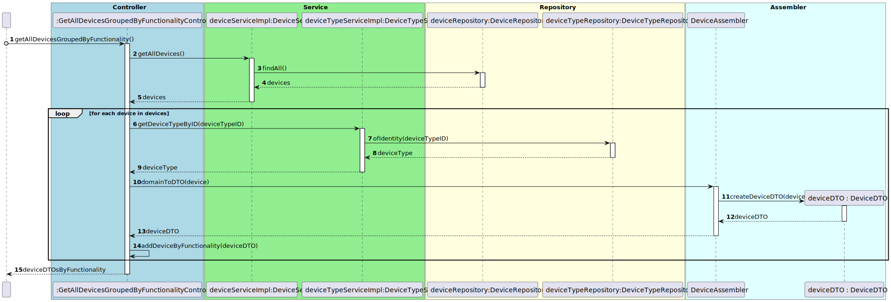

# UC09 

## 0. Description

To get all Device(s) grouped by functionality

## 1. Analysis
The system will provide a list of all devices in the house, grouped by functionality type.
Each device has the ID of the room in which it exists.

### 1.1. Use Case description
_To get list of devices grouped by functionality_
    
        Use Case Name: To get list of devices grouped by functionality
    
        Actor: Power User / Administrator
    
        Goal: To get the list of all devices in the house grouped by functionality
    
        Preconditions:
        The Power User / Administrator has access to the device management interface within the system.
        The system has a mechanism for storing and accessing the devices in the house.

        Trigger: The Power User / Administrator selects the option to get all devices in the house grouped by functionality.
    
        Basic Flow:
        The Power User / Administrator selects the option to get all devices grouped by functionality.
        The system provides a list with all the devices in the house, grouped by functionality.
    
        Alternative Flows:
        Non-existing list: If there are no devices in the house, the list is null.

### 1.2. Dependency on other use cases
No dependencies.

### 1.3. Relevant domain aggregate model 

### 1.4. System Sequence Diagram

## 2. Design

### 2.1. Class Diagram

### 2.2. Sequence Diagram

### 2.3. Applied Patterns
- Single Responsibility Principle: Each class has a single responsibility, which promotes a better code organization 
and maintainability.
- Data Transfer Object: The DeviceDTO is used to transfer the Device 
data, respectively, between the service layer and the controller, which guarantees protection for the domain.
- Repository: The DeviceRepository is used to store and retrieve the Device data.
