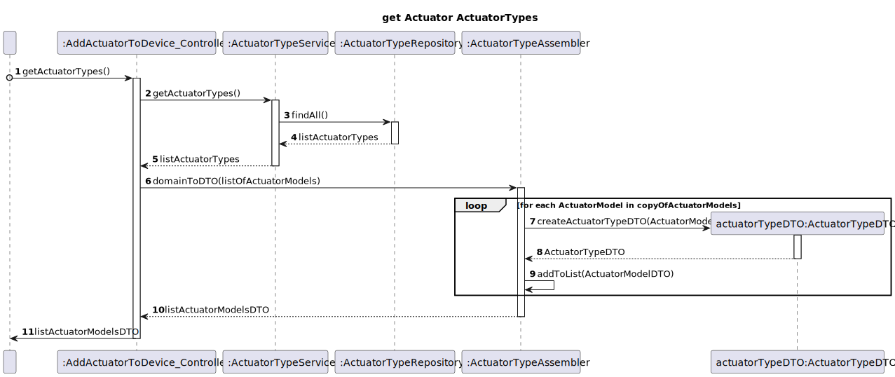

# UC10

## 0. Description

To add an actuator to an existing Device in a Room.

## 1. Analysis
All actuators will have an ID, a device ID, a model, a name, an actuator type ID.
Some actuators might have additional information.

### 1.1. Use Case Description
_To add an actuator to a device_

    Use Case Name: To add an actuator to a device

    Actor: Power User / Administrator

    Goal: To add an actuator to a device

    Preconditions:
    The Power User / Administrator has access to the device management interface within the system.
    The system has a mechanism for storing and accessing the devices in the room.
    The system has a mechanism for storing and accessing the actuators in the room.
    The system has a mechanism for storing and accessing the actuator models in the room.
    The system has a mechanism for storing and accessing the actuator types in the room.
    Trigger: The Power User / Administrator selects the option to add an actuator to a device.

    Basic Flow:
    The Power User (or Administrator) selects the option to add an actuator to an existing device in a room.
    The system provides a list with all the rooms in the house.
    The Power User (or Administrator) selects a room from the list.
    The system provides a list with all the devices in the room.
    The Power User (or Administrator) selects a device from the list.
    The system provides a list with all the actuator types supported by the system.
    The Power User (or Administrator) selects an actuator type from the list.
    The system provides a list with all the actuator models of that type supported by the system.
    The Power User (or Administrator) selects an actuator model from the list.
    The system provides a form to fill in the actuator description.
    The Power User (or Administrator) fills in the actuator description.
    The Power User (or Administrator) submits the form.
    The system adds the new actuator to the device.

    Alternative Flows:
    1. The Power User / Administrator selects an actuator that does not exist in the room.
    2. The Power User / Administrator selects a device that does not exist in the room.
    3. The Power User / Administrator selects a device that is deactivated.

### 1.2. Dependency of other user stories
This use case depends on UC03 and UC06.

### 1.3. Relevant domain aggregate model

### 1.4. Customer Specifications and Clarifications

- Question 1
  - Q: é possível adicionar um atuador a um device que se encontra desativado? 
  - A: Não.

### 1.5. System Sequence Diagram

## 2. Design

### 2.1 Class Diagram

### 2.2. Sequence Diagram

### 2.3 Applied Patterns
- All classes have only one and well-defined responsibility.
- A controller (AddActuatorController) receives and coordinates system operations connecting the UI layer to the App's logic layer.
- The flow of this process is entirely made following this principle: for a particular responsibility, it is determined the information needed to fulfill it and where that information is stored.
- Services that represent a concept outside the problem's domain, but they have set of responsibilities designed to achieve low coupling, high cohesion and the potential for reuse.
- Dependencies between classes are at their lowest point possible. The use of Services classes reduced the dependency level between them.
- Due to low coupling, the responsibilities of each class are highly focused, therefore cohesion's high.
