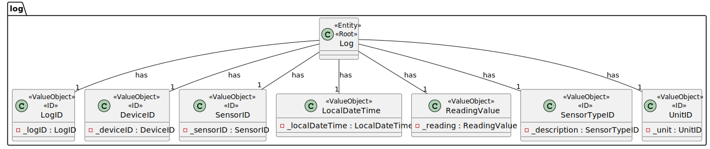
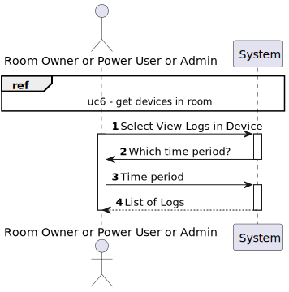
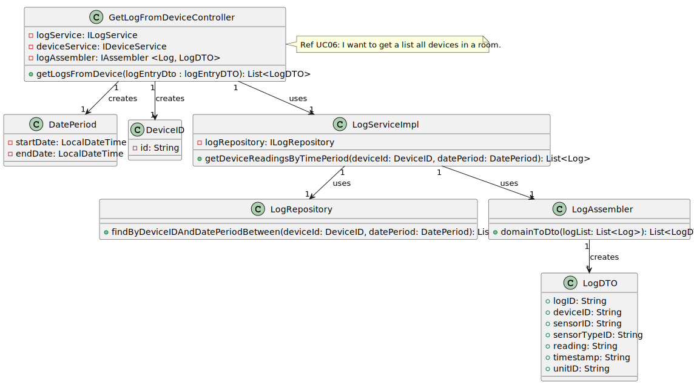
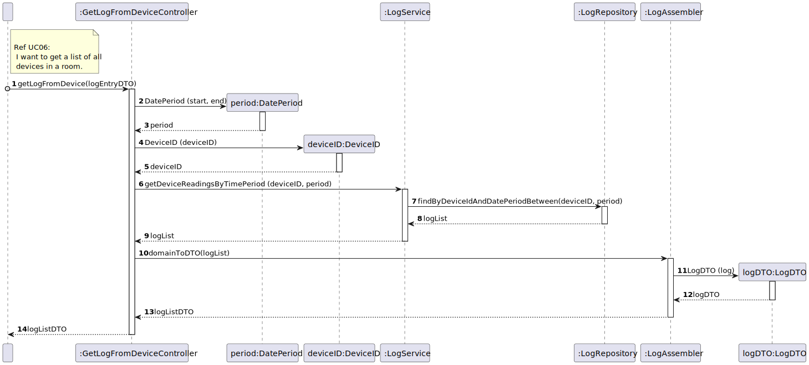
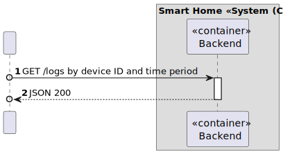
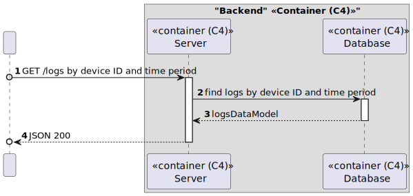
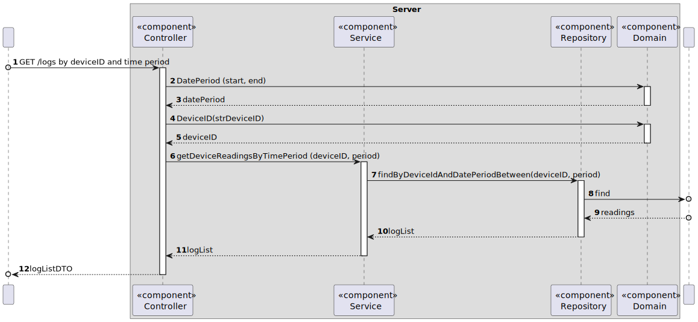

# UC11

## 0. Description

To get log (measurements) of a device in a room, in a given period.

## 1. Analysis
A device will be selected, as well as a time frame.
The system will then return a list of all logs recorded by the selected device during the specified period.

### 1.1. Use Case Description

    Use Case Name: To get a log of all measurements of a device in a room, in a given period.

    Actor: Room Owner [or Power User, or Administrator]

    Goal: To provide to the user a list of logs of a device in a room, in a given period.

    Preconditions:
    The user must have selected a room and a device.

    Trigger: The user selects an option to get the logs for a specific device

    Basic Flow:
    1. The user selects a room.
    2. The user selects a device.   
    3. The user selects "Logs" option.
    3. The system provides to the user a log for that device.

    Alternative Flows:
    1. The user selects a device that has an empty log.
    2. The user selects a device and a period that has no logs.

### 1.2. Dependency of other use cases
This use case depends on UC03 and UC06.

### 1.3. Relevant domain aggregate model

### 1.4. System Sequence Diagram

## 2. Design

### 2.1 Class Diagram

### 2.2. Sequence Diagram

### 2.3. C4 & 4+1 model
#### Level 2

#### Level 3

#### Level 4

### 2.3 Applied Patterns
- All classes have only one and well-defined responsibility.
- A controller receives and coordinates system operations connecting the UI layer to the App's logic layer.
- The flow of this process is entirely made following this principle: for a particular responsibility, it is determined the information needed to fulfill it and where that information is stored.
- Services that represent a concept outside the problem's domain, but they have set of responsibilities designed to achieve low coupling, high cohesion and the potential for reuse.
- Dependencies between classes are at their lowest point possible. The use of Services classes reduced the dependency level between them.
- Due to low coupling, the responsibilities of each class are highly focused, therefore cohesion's high.
