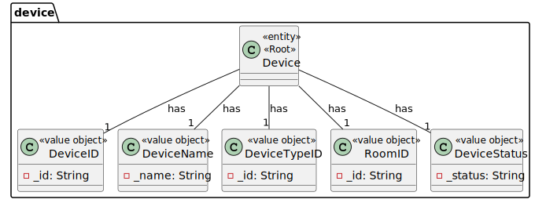
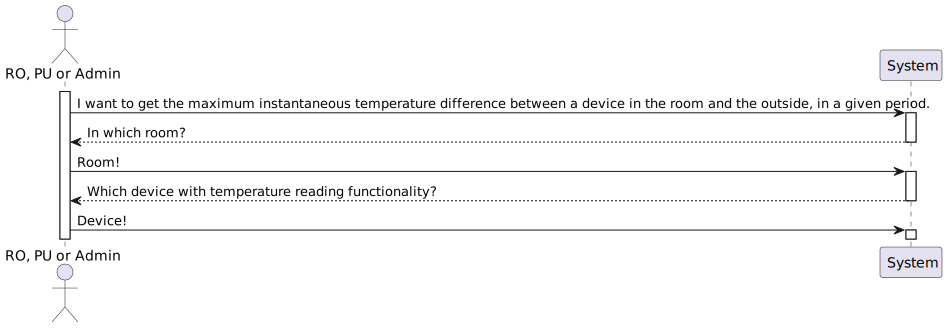
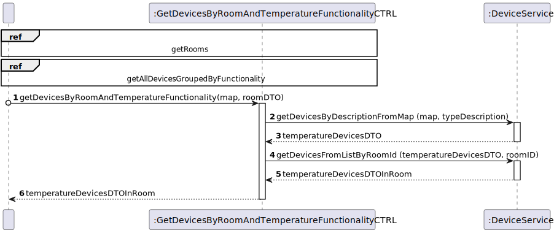
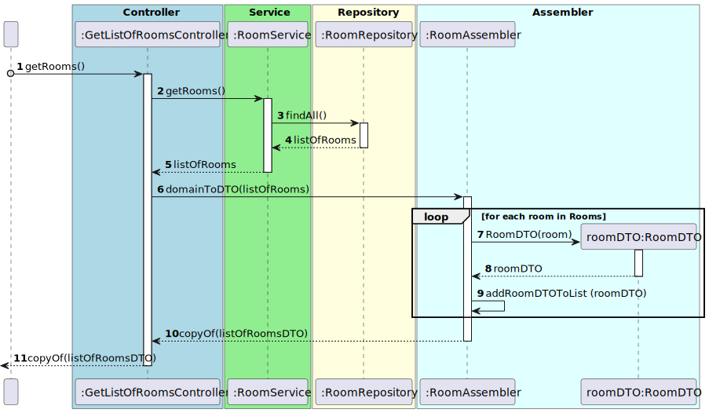
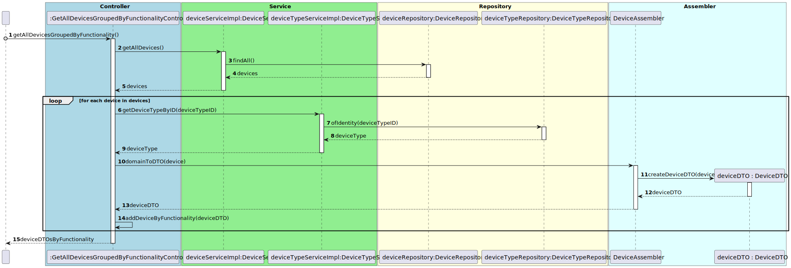

# UC12

## 0. Description

To get the devices in a room with temperature functionality.

## 1. Analysis
The system will provide the user with a list of devices in the selected room with temperature functionality.

### 1.1. Use Case Description
_To get the devices in a room with temperature functionality_

    Use Case Name: To get the devices in a room with temperature functionality

    Actor: Room Owner [or Power User, or Administrator]

    Goal: To provide to the user a list of devices in the selected room with temperature functionality.

    Preconditions:
    The user must have selected a room.

    Trigger: The user selects an option to get the devices in a room with temperature functionality.

    Basic Flow:
    1. The user selects a room.
    2. The system provides to the user a list of devices in the selected room with temperature functionality.

    Alternative Flows:
    1. The user selects a room that does not exist.
    2. The user selects a room that has no devices with temperature functionality.

### 1.2. Dependency on other use cases
This use case depends on UC03 and UC09.

### 1.3. Relevant domain aggregate model

### 1.4. Customer Specifications and Clarifications
* 11/04/2024 - "Relativamente à US34, no conjunto de dados de teste não se pode assumir que os dados de diferentes sensores foram obtidos no mesmo instante.
  A probabilidade de isso acontecer na realidade é praticamente nula."

### 1.5. System Sequence Diagram

## 2. Design

### 2.1 Class Diagram
N/A

### 2.2. Sequence Diagram

#### Ref - Get rooms

#### Ref - Get all devices grouped by functionality

### 2.3 Applied Patterns
- All classes have only one and well-defined responsibility.
- A controller receives and coordinates system operations connecting the UI layer to the App's logic layer.
- The flow of this process is entirely made following this principle: for a particular responsibility, it is determined the information needed to fulfill it and where that information is stored.
- Services that represent a concept outside the problem's domain, but they have set of responsibilities designed to achieve low coupling, high cohesion and the potential for reuse.
- Dependencies between classes are at their lowest point possible. The use of Services classes reduced the dependency level between them.
- Due to low coupling, the responsibilities of each class are highly focused, therefore cohesion's high.
