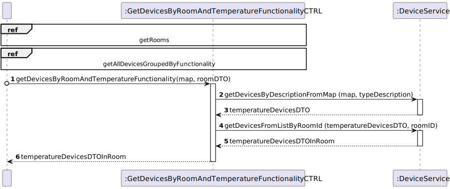

# UC13

## 0. Description

To get the maximum instantaneous temperature difference between a device in the room and the outside, in a given period.

## 1. Analysis
The system will calculate the maximum temperature difference between a device in the room 
and the outside temperature, in a given period, and provide the result.

### 1.1. Use Case Description
_To get the maximum instantaneous temperature difference between a device in the room and the outside, in a given period_

    Use Case Name: To get the maximum instantaneous temperature difference between a device in the room and the outside, in a given period

    Actor: Room Owner [or Power User, or Administrator]

    Goal: To provide to the user the maximum instantaneous temperature difference between a device in the room and the outside, in a given period.

    Preconditions:
    The user must have selected a room.
    The system must have provided to the user a list of devices in the room with temperature functionality.

    Trigger: The user selects an option to get the maximum instantaneous temperature difference between a device in the room and the outside, in a given period.

    Basic Flow:
    1. The user selects a device in the room.
    2. The user selects a time frame.
    3. The system calculates the maximum temperature difference between the device and the outside temperature in the selected time frame.
    4. The system displays the maximum temperature difference between the device and the outside temperature in the selected time frame.

    Alternative Flows:
    1. The user selects a device that does not exist.
    2. The user selects a device that has no temperature functionality.
    3. The user selects a time frame that does not exist.
    4. The user selects a time frame that is not valid.

### 1.2. Dependency on other use cases
This use case depends on UC12.

### 1.3. Relevant domain aggregate model

### 1.4. Customer Specifications and Clarifications
* 11/04/2024 - "Relativamente à US34, no conjunto de dados de teste não se pode assumir que os dados de diferentes sensores foram obtidos no mesmo instante.
  A probabilidade de isso acontecer na realidade é praticamente nula."

### 1.5. System Sequence Diagram

## 2. Design

### 2.1 Class Diagram

### 2.2. Sequence Diagram

#### Ref - Get devices by room and temperature functionality

### 2.3 Applied Patterns
- All classes have only one and well-defined responsibility.
- A controller receives and coordinates system operations connecting the UI layer to the App's logic layer.
- The flow of this process is entirely made following this principle: for a particular responsibility, it is determined the information needed to fulfill it and where that information is stored.
- Services that represent a concept outside the problem's domain, but they have set of responsibilities designed to achieve low coupling, high cohesion and the potential for reuse.
- Dependencies between classes are at their lowest point possible. The use of Services classes reduced the dependency level between them.
- Due to low coupling, the responsibilities of each class are highly focused, therefore cohesion's high.
