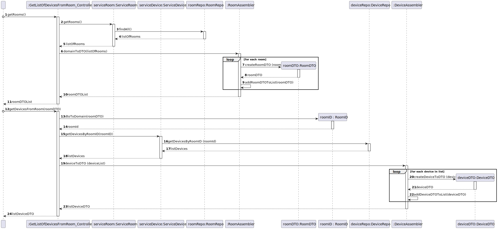

# UC15

## 0. Description

To get a list of actuators in a given device.

## 1. Analysis
The system will retrieve a list of all actuators in a device to the user.

### 1.1. Use Case Description
_To get a list of actuators in a given device_

    Use Case Name: To get a list of actuators in a given device

    Actor: Room Owner [or Power User, or Administrator]

    Goal: To provide to the user a list of all actuators in a device.

    Preconditions:
    The user must select the device that he wants.

    

    Basic Flow:
    1. The user selects a device.

    Alternative Flows:
    1. The user selects the wrong device.
   

### 1.2. Dependency on other use cases
This use case depends on UC03 and UC06.

### 1.3. Relevant domain aggregate model

### 1.4. Customer Specifications and Clarifications

### 1.5. System Sequence Diagram

## 2. Design

### 2.1 Class Diagram

### 2.2. Sequence Diagram

#### Ref - Get all devices grouped by functionality

### 2.3 Applied Patterns
- All classes have only one and well-defined responsibility.
- A controller receives and coordinates system operations connecting the UI layer to the App's logic layer.
- The flow of this process is entirely made following this principle: for a particular responsibility, it is determined the information needed to fulfill it and where that information is stored.
- Services that represent a concept outside the problem's domain, but they have set of responsibilities designed to achieve low coupling, high cohesion and the potential for reuse.
- Dependencies between classes are at their lowest point possible. The use of Services classes reduced the dependency level between them.
- Due to low coupling, the responsibilities of each class are highly focused, therefore cohesion's high.