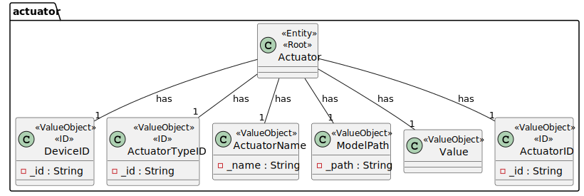
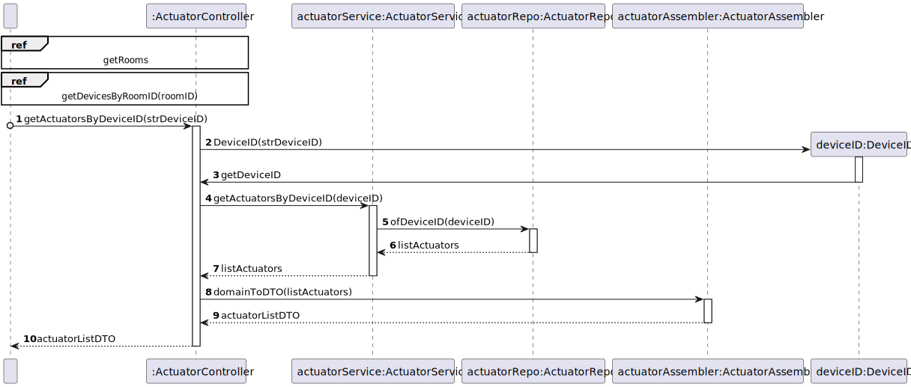

# UC16

## 0. Description

To close a blind roller that is in a room.

## 1. Analysis
The system must provide the user with the ability to close a blind roller. The user must select the blind roller device and the system must send the command to close the blind roller.

### 1.1. Use Case Description
_To close a blind roller that is in a room_

    Use Case Name: To close a blind roller that is in a room.

    Actor: Room Owner [or Power User, or Administrator]

    Goal: To close a blind roller that is in a room

    Preconditions:
    The user must select a device with a blind roller actuator    

    Basic Flow:
    1. The user selects the device with the blind roller actuator.
    2. The user selects the value to close the blind roller to.
    
    Alternative Flows:
    1. The user selects the wrong device.
    2. The user selects a value that is higher than the current blind roller value, so it won't close.

### 1.2. Dependency on other use cases
This use case depends on UC15.

### 1.3. Relevant domain aggregate model

### 1.4. Customer Specifications and Clarifications
* "O atuador só pode fechar. Mas pode ser parcial."
* "O valor recebido pelo atuador pode ser a posição final. 0% é fechado.
* "O device que representa o blind roller poderá ter esse atuador e esse sensor.2

### 1.5. System Sequence Diagram

## 2. Design

### 2.1 Class Diagram

### 2.2. Sequence Diagram

#### Ref - Get actuators by device ID

### 2.3 Applied Patterns
- All classes have only one and well-defined responsibility.
- A controller receives and coordinates system operations connecting the UI layer to the App's logic layer.
- The flow of this process is entirely made following this principle: for a particular responsibility, it is determined the information needed to fulfill it and where that information is stored.
- Services that represent a concept outside the problem's domain, but they have set of responsibilities designed to achieve low coupling, high cohesion and the potential for reuse.
- Dependencies between classes are at their lowest point possible. The use of Services classes reduced the dependency level between them.
- Due to low coupling, the responsibilities of each class are highly focused, therefore cohesion's high.