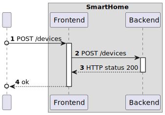
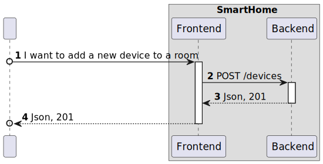

# UC19

## 0. Description

to add a new device to a room using the Web App.

## 1. Analysis

The system must provide the user with the ability to add a new device to a room using the Web App.

### 1.1. Use Case Description

_To add a new device to a room using the Web App_

    Use Case Name: To add a new device to a room using the Web App.

    Actor: User

    Goal: To add a new device to a room using the Web App

    Preconditions:
    The user must be connected to VPN DEI.    

    Basic Flow:
    1. The user opens the main page.
    2. The user selects the room where the device will be added.
    3. The user clicks on the "Add Device" button.
    4. The user selects the device to be added.
    5. The user clicks on the "Add" button.

### 1.2. Dependency on other use cases

UC21 - To have a list of all rooms in the house in my Web App.

### 1.3. System Sequence Diagram

## 2. Design

### 2.1. Sequence Diagram

### 2.2 Applied Patterns

- All classes have only one and well-defined responsibility.
- **Container Components:** We use container components to manage state and business logic.
- **Presentational Components:** Presentational components focus solely on rendering UI based on the props they receive.
- **Material-UI for UI Components**: Instead of CSS Modules, we integrate Material-UI for styling and UI components. **
  For styling our components, we adopt CSS Modules.
- **State Management with Redux**: We employ Redux to manage the global state of our application.