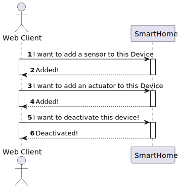
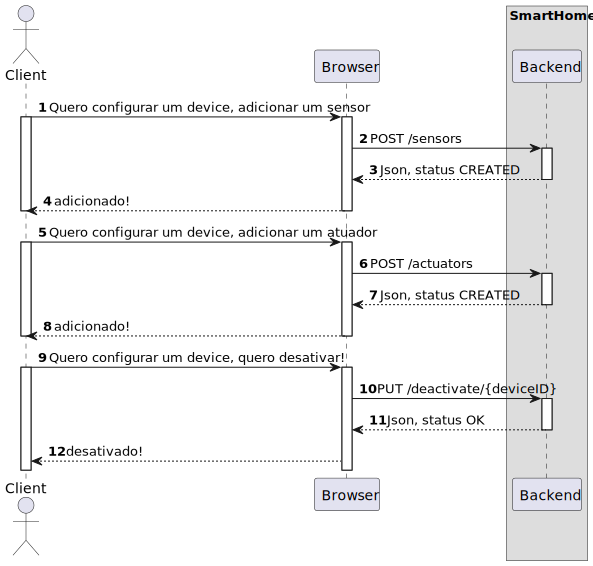

# UC20

## 0. Description

As a Power User, I want to configure a device in a room using the Web App.

## 1. Analysis

Allows the user to configure a device in an existing room in the house using the Web App.

This use case involves fetching available types of sensor, sensor types, sensor models from the backend and updating the given device with the defined sensor. The same process occurs for the process of adding an actuator.

In addition, the Web App allows the user to deactivate a device in a room.

### 1.1. Use Case Description

_To configure a device in a room using the Web App_

    Use Case Name: As a Power User, I want to configure a device in a room using the Web App.

    Actor: Power User

    Goal: To add configure a device in a room using the Web App

    Basic Flow:
    1. The user opens the main page.
    2. The user selects the room.
    3. The user selects a device.
    4. The user selects clicks on Add Sensor or Add Actuator button.
    5. The user configures the sensor or actuator.
    6. The user clicks on the deactivate button if he whishes to deactivate a device.

### 1.2. Dependency on other use cases

UC21 - To have a list of all rooms in the house in my Web App.
UC22 - To have a list of all devices in a room in my Web App.

### 1.3. System Sequence Diagram

## 2. Design

### 2.1. Sequence Diagram

### 2.2 Applied Patterns

- All classes have only one and well-defined responsibility.
- **Container Components:** We use container components to manage state and business logic.
- **Presentational Components:** Presentational components focus solely on rendering UI based on the props they receive.
- **Material-UI for UI Components**: Instead of CSS Modules, we integrate Material-UI for styling and UI components. **
  For styling our components, we adopt CSS Modules.
- **State Management with Redux**: We employ Redux to manage the global state of our application.