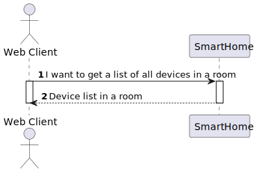
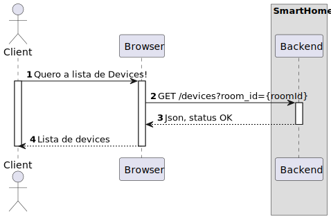

# UC22

## 0. Description

As a Room Owner [or Power User, or Administrator], I want to get a list of devices in a room using the Web App.

## 1. Analysis

Allows a User to see a list of all rooms in the house using the Web App. This use case involves fetching the list of
rooms from the backend and displaying them in the Web App.

### 1.1. Use Case Description

_To get a list of devices in a room using the Web App_

    Use Case Name: As a Room Owner [or Power User, or Administrator], I want to get a list of devices in a room using the Web App.

    Actor: Room Owner

    Goal: To get a list of devices in a room using the Web App

    Basic Flow:
    1. The user opens the main page.
    2. The user selects the room.
    3. The user sees the list of devices in the room.

### 1.2. Dependency on other use cases

UC21 - To have a list of all rooms in the house in my Web App.

### 1.3. System Sequence Diagram

## 2. Design

### 2.1. Sequence Diagram

### 2.2 Applied Patterns

- All classes have only one and well-defined responsibility.
- **Container Components:** We use container components to manage state and business logic.
- **Presentational Components:** Presentational components focus solely on rendering UI based on the props they receive.
- **Material-UI for UI Components**: Instead of CSS Modules, we integrate Material-UI for styling and UI components. **
  For styling our components, we adopt CSS Modules.
- **State Management with Redux**: We employ Redux to manage the global state of our application.