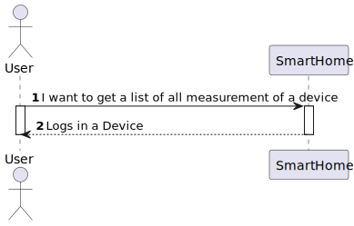
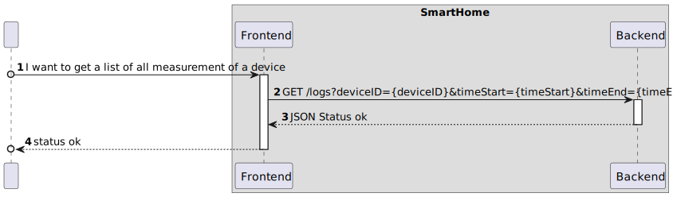

## US43

## 0. Description

As a Room Owner [or Power User, or Administrator], I want to get a list of all devices in a room, so that I can configure them.

## 1. Analysis

Allows a Room Owner to see a list of all devices in a room using the Web App. This use case involves fetching the list of
rooms from the backend, and then fetch all the devices and displaying them in the Web App.

The User should be able to select a device in order to configure it.

### 1.1. Use Case Description

_To get a list of logs in a device using the Web App_

    Use Case Name: As a Room Owner [or Power User, or Administrator], I want to get a list of logs in a device using the Web App.

    Actor: Room Owner

    Goal: To get a list of logs in a device using the Web App

    Basic Flow:
    1. The user opens the main page.
    2. The user selects the room.
    3. The user selects the device.
    4. The user view and select the initial date and final date time period.
    5. The user sees the list of logs in the device.

### 1.2 Customer Specifications and Clarifications

UC22 - To have a list of all devices in a room in my Web App.

### 1.3. System Sequence Diagram

## 2. Design

### 2.1. Sequence Diagram

### 2.2 Applied Patterns

- All classes have only one and well-defined responsibility.
- **Container Components:** We use container components to manage state and business logic.
- **Presentational Components:** Presentational components focus solely on rendering UI based on the props they receive.
- **Material-UI for UI Components**: Instead of CSS Modules, we integrate Material-UI for styling and UI components. **
  For styling our components, we adopt CSS Modules.
- **State Management with Redux**: We employ Redux to manage the global state of our application.