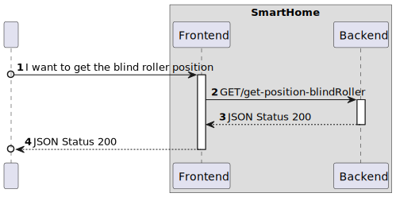
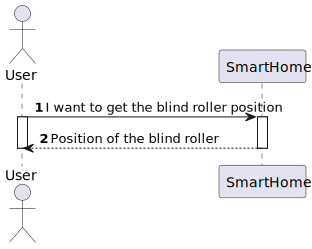
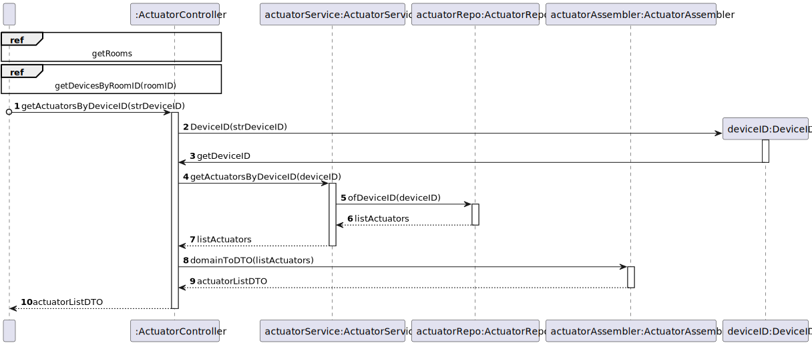

# UC24

## 0. Description

To get a blind roller position in a room.

## 1. Analysis

The system must provide the user with the ability to get a blind roller. The user must select the blind roller device
and the system must send the blind roller position value.

### 1.1. Use Case Description

_To get a blind roller position that is in a room_

    Use Case Name: To get a blind roller position in a room.

    Actor: Room Owner [or Power User, or Administrator]

    Goal: To get a blind roller position in a room.

    Preconditions:
    The user must select a device with a blind roller actuator    

    Basic Flow:
    1. The user opens the main page.
    2. The user selects the room.
    3. The user selects a device.
    4. The user selects clicks on the blind roller device.
    5. The browser sends the GET request to the server to obtain the blind roller position Value.
    6. The system responde with the value.
    7. The value is shown in on the web app.
    
    Alternative Flows:
    1. The user selects the wrong device.
    2. The system fails and returns an error value.

### 1.4. System Sequence Diagram

## 2. Design

### 2.1. Sequence Diagram

#### Ref - Get actuators by device ID

### 2.2 Applied Patterns

- All classes have only one and well-defined responsibility.
- **Container Components:** We use container components to manage state and business logic.
- **Presentational Components:** Presentational components focus solely on rendering UI based on the props they receive.
- **Material-UI for UI Components**: Instead of CSS Modules, we integrate Material-UI for styling and UI components. **
  For styling our components, we adopt CSS Modules.
- **State Management with Redux**: We employ Redux to manage the global state of our application.