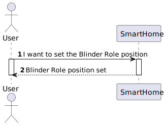
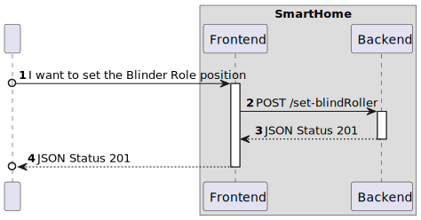

# UC25

## 0. Description

To set the position for a blind roller that is in a room.

## 1. Analysis

The system must provide the user with the ability to set a blind roller position. The user must select the blind roller
device and the system must send the command to set the blind roller.

### 1.1. Use Case Description

_To set a blind roller that is in a room_

    Use Case Name: To set a blind roller that is in a room.

    Actor: Room Owner [or Power User, or Administrator]

    Goal: To set a blind roller that is in a room

    Preconditions:
    The user must select a device with a blind roller actuator on the web app.   

    Basic Flow:
    1. The user opens the main page.
    2. The user selects the room.
    3. The user selects a device.
    4. The user selects clicks on the blind roller device.
    5. The user inserts the new value on the respective box and clicks send.
    6. The system sends the new value to the backend.
    7. The system updates the blind roller position value.
    
    
    Alternative Flows:
    1. The user selects the wrong device.
    2. The user selects a value out of the range of the blinroller.

### 1.2. Dependency on other use cases

This use case depends on UC15.

### 1.4. System Sequence Diagram

## 2. Design

### 2.1. Sequence Diagram

### 2.2 Applied Patterns

- All classes have only one and well-defined responsibility.
- **Container Components:** We use container components to manage state and business logic.
- **Presentational Components:** Presentational components focus solely on rendering UI based on the props they receive.
- **Material-UI for UI Components**: Instead of CSS Modules, we integrate Material-UI for styling and UI components. **
  For styling our components, we adopt CSS Modules.
- **State Management with Redux**: We employ Redux to manage the global state of our application.